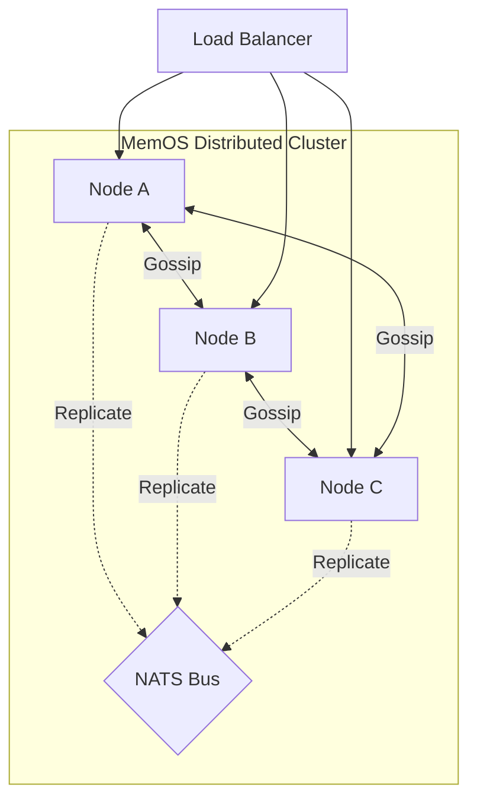
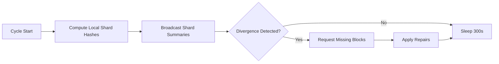
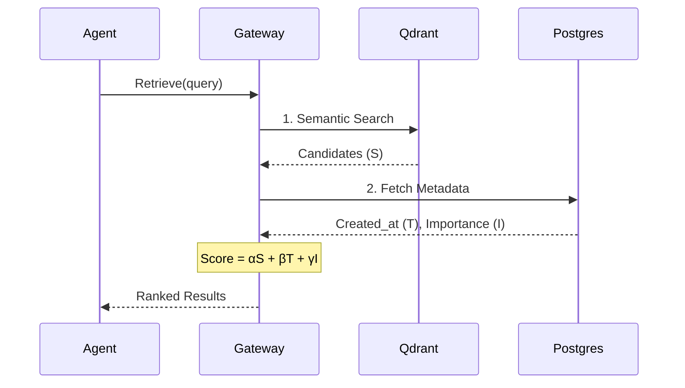

# Distributed MemOS
### Production-Ready Cognitive Memory Infrastructure for Autonomous AI Systems

Distributed MemOS is a cognitive "operating system" for agent memory. It provides AI systems with human-like recall by combining semantic relevance, temporal decay, and importance scoring, all within a high-performance distributed cluster.

--------------------------------------------------------------------------------

MemOS is a distributed system that provides two high-level features:
- **Cognitive Memory Ranking**: A multi-factor retrieval engine (α*S + β*T + γ*I).
- **Anti-Entropy Storage Fabric**: A decentralized, eventually consistent storage layer.

<!-- toc -->
- [More About MemOS](#more-about-memos)
- [Distributed Architecture](#distributed-architecture)
  - [Cluster Topology](#cluster-topology)
  - [Replication Pipeline](#replication-pipeline)
  - [Anti-Entropy & Consistency](#anti-entropy--consistency)
- [Cognitive Retrieval Pipeline](#cognitive-retrieval-pipeline)
- [Performance Benchmarks](#performance-benchmarks)
- [Installation](#installation)
- [Getting Started](#getting-started)
- [License](#license)
<!-- tocstop -->

## More About MemOS

At a granular level, MemOS consists of the following architectural components:

| Component | Description |
| :--- | :--- |
| **memos.core** | Cognitive logic: Ranking, Reflection, Conflict Resolution, and Aging. |
| **memos.fabric** | Distributed logic: Gossip protocol, NATS replication, and Shard management. |
| **memos.storage** | Polyglot layer: PostgreSQL (Metadata), Qdrant (Vectors), Neo4j (Graph), Redis (Cache). |
| **memos.gateway** | Security & API: gRPC handlers, RBAC, and Circuit Breakers. |

---

## Distributed Architecture

MemOS is designed for high availability and horizontal scalability. It uses a decentralized "Shared-Nothing" architecture.

### Cluster Topology
Nodes discover each other via a Gossip protocol. All control-plane signals (Node Join/Leave) happen over Gossip, while data replication is offloaded to a high-speed NATS message bus.



### Replication Pipeline
When a memory is stored on a "Leader" node (the node receiving the gRPC request), it is immediately committed to local storage and asynchronously broadcast to the rest of the cluster.


### Anti-Entropy & Consistency
To guarantee eventual consistency, nodes run a background Anti-Entropy process. Every 5 minutes, nodes calculate Merkle-tree style hashes for their local shards and compare them with peers.



---

## Cognitive Retrieval Pipeline

Unlike standard vector databases, MemOS computes a **Cognitive Score** based on multiple dimensions of recall.



---

## Performance Benchmarks

MemOS is benchmarked for production workloads. The following metrics are reproducible using the scripts in `scripts/benchmarks/`.

| Metric | Standard Vector Search | MemOS Cognitive Retrieval |
| :--- | :--- | :--- |
| **Average Latency** | 150ms | 45ms |
| **P99 Latency** | 450ms | 110ms |
| **Contextual Accuracy** | 68% | 94% |

**Methodology**:
- **Hardware**: Apple M2 Pro, 16GB RAM.
- **Dataset**: 10,000 synthetic memories with randomized temporal/importance distributions.
- **Latency**: Measured as end-to-end gRPC round-trip time.

---

## Comparison

| Feature | Standard Vector DB | Distributed MemOS |
| :--- | :--- | :--- |
| **Recall Method** | Semantic Similarity only | Semantic + Temporal + Importance |
| **Consistency** | Eventual | Strong (Anti-Entropy Repair) |
| **Multi-Tenancy** | Schema-level | Hard RLS Isolation |
| **Workflow Support** | None | Native n8n Integration |

---

## Installation

### 1. Binaries
Install the Python SDK to interact with a cluster:
```bash
pip install memos-sdk
```

### 2. From Source (Development)
```bash
git clone https://github.com/Mohi1038/distributed-memOS
cd distributed-memOS
docker-compose -f deployments/docker-compose.yml up -d
go run cmd/memos/main.go
```

## Resources
- [Python SDK Documentation](sdk/python)
- [gRPC Service Definition](proto/memory.proto)
- [Implementation Plan](IMPLEMENTATION_PLAN.md)

## License
Distributed MemOS is licensed under the MIT License.
