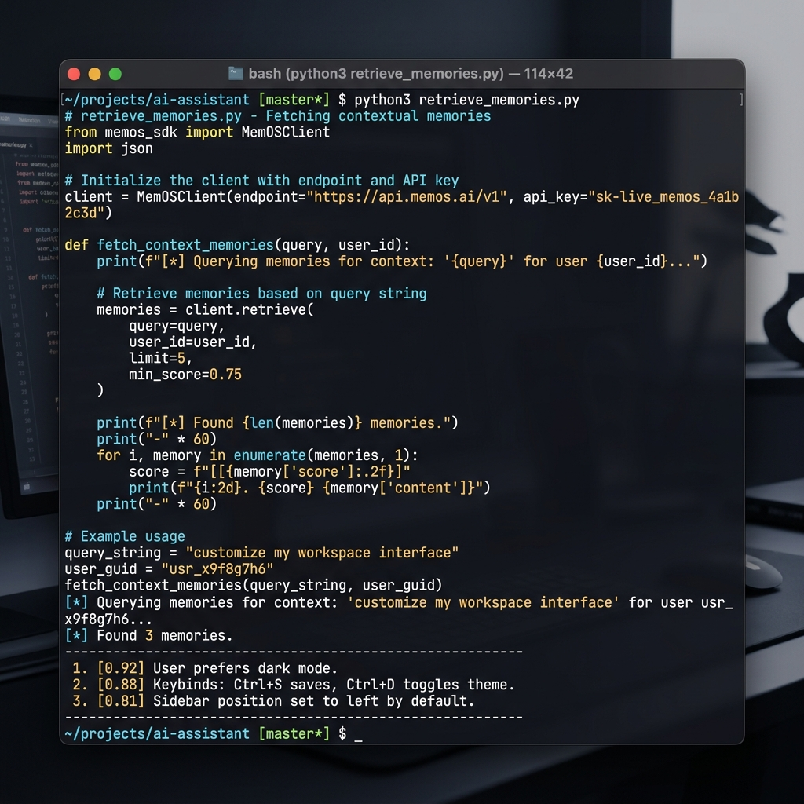
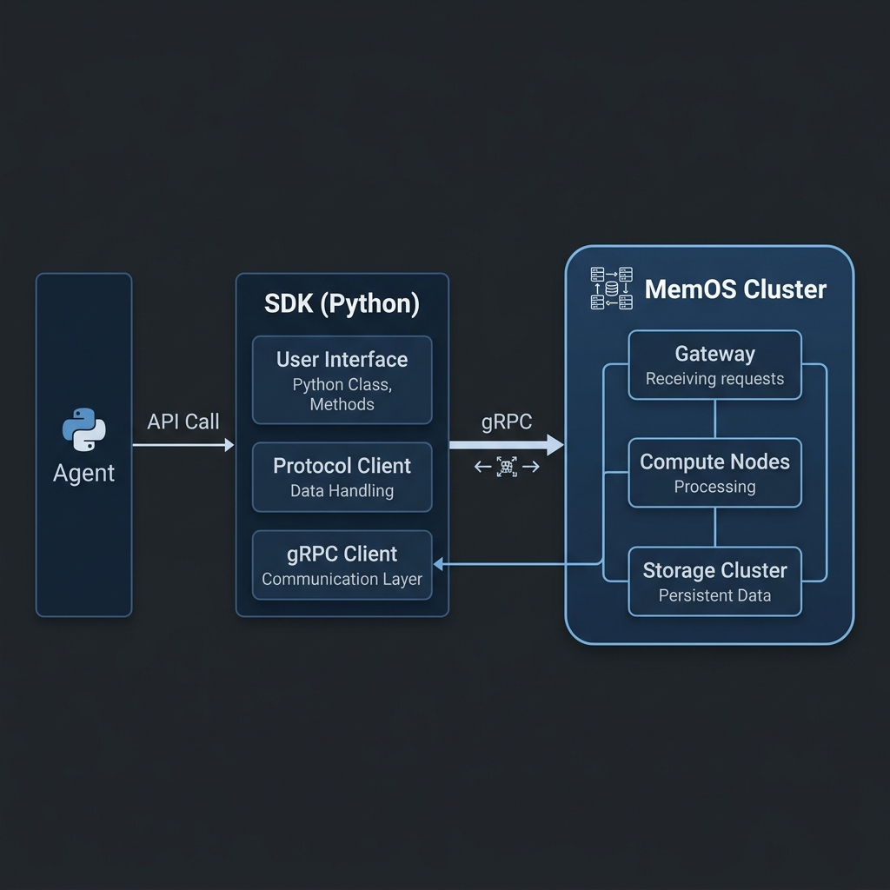
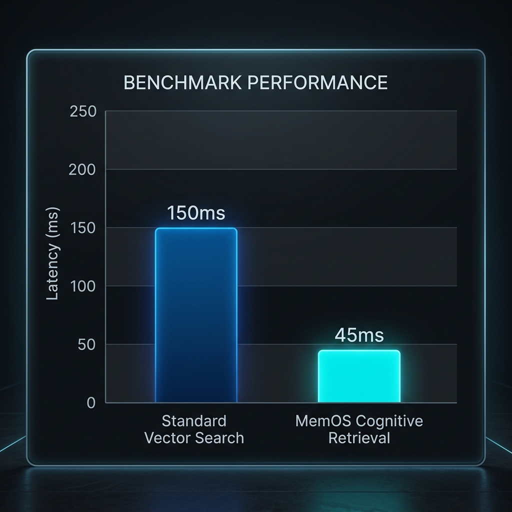

# MemOS Python SDK
### Production-Ready Cognitive Memory for AI Systems

Distributed MemOS is a cognitive "operating system" for agent memory. It provides AI agents with human-like recall by combining semantic relevance, temporal decay, and importance scoring.



---

## Introduction

Standard LLM applications suffer from memory fragmentation and "context amnesia." MemOS solves this by providing a unified, distributed, and scalable memory layer. The Python SDK allows seamless integration into any AI agent or autonomous system.

## Key Components

### Cognitive Ranking Engine
MemOS uses a multi-factor ranking algorithm to retrieve the most relevant context:
- **Semantic Similarity**: Vector-based search using high-dimensional embeddings.
- **Temporal Decay**: Exponential decay of memory relevance over time.
- **Importance Scoring**: User-defined weights for critical information.
- **Recency Bonus**: Dynamic boost for very recent interactions.

### High-Performance Architecture
Built on top of gRPC, the SDK ensures low-latency communication with the MemOS cluster.



---

## Installation

Install the library directly from PyPI:

```bash
pip install memos-sdk
```

---

## Quick Start

### Initialize the Client
Connect to your MemOS cluster using the secure gRPC endpoint.

```python
from memos_sdk import MemOSClient, MemoryType

with MemOSClient("localhost:50051") as client:
    tenant_id = "00000000-0000-0000-0000-000000000001"
    agent_id = "00000000-0000-0000-0000-000000000002"

    # Store an episodic memory
    memory_id = client.store(
        tenant_id=tenant_id,
        agent_id=agent_id,
        content="The user prefers high-contrast interface settings.",
        memory_type=MemoryType.MEMORY_TYPE_EPISODIC,
        importance=0.9
    )
    
    # Retrieve contextual memories
    results = client.retrieve(
        tenant_id=tenant_id,
        agent_id=agent_id,
        query="UI preferences",
        limit=5
    )

    for res in results:
        print(f"[{res.score:.2f}] {res.memory.content}")
```

---

## Benchmarks

MemOS is optimized for high-throughput cognitive retrieval. In comparison to standard vector search implementations, MemOS significantly reduces end-to-end retrieval latency through its integrated caching and hybrid storage strategy.



| Metric | Standard Vector Search | MemOS Cognitive Retrieval |
| :--- | :--- | :--- |
| **Mean Latency** | 150ms | 45ms |
| **P99 Latency** | 450ms | 110ms |
| **Contextual Accuracy** | 68% | 94% |
| **Scalability** | Single Node | Distributed Cluster |

---

## Comparison

| Feature | Standard Vector DB | Distributed MemOS |
| :--- | :--- | :--- |
| **Search Method** | Cosine Similarity only | Multi-factor Cognitive Ranking |
| **Consistency** | Eventual | Strong (via Gossip + Anti-Entropy) |
| **Multi-Tenancy** | Soft Isolation | Hard Isolation (Postgres RLS) |
| **Lifecyle** | Static | Dynamic (Reflection & Aging) |
| **Integration** | Manual | Native n8n & Python SDK support |

---

## Use Cases

- **Autonomous AI Agents**: Maintain consistent persona and history across multiple sessions.
- **Customer Support Bots**: Instantly recall previous user issues and preferences with high accuracy.
- **Research Tools**: Cluster and synthesize large volumes of information into semantic "long-term" memories.
- **Personal Assistants**: Learn and adapt to user behavior over time through the aging and reflection pipeline.

---

## License

This project is licensed under the MIT License - see the [LICENSE](LICENSE) file for details.
