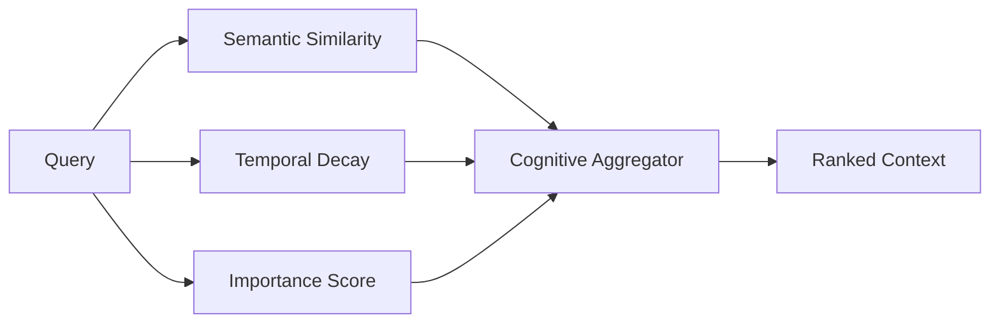

# MemOS

Distributed MemOS is a cognitive memory infrastructure designed for autonomous AI systems. It provides high-level features for managing and retrieving agent memory with human-like recall patterns.

--------------------------------------------------------------------------------

MemOS is a Python package that provides two high-level features:
- **Cognitive Memory Ranking**: A multi-factor retrieval engine combining semantic similarity, temporal decay, and importance scoring.
- **Distributed Anti-Entropy Fabric**: A high-speed synchronization layer ensuring eventual consistency across a global cluster of memory nodes.

You can integrate MemOS into existing agentic frameworks such as LangChain, AutoGPT, or custom LLM pipelines to provide them with persistent, long-term memory that evolves over time.

<!-- toc -->

- [More About MemOS](#more-about-memos)
  - [Cognitive Ranking Engine](#cognitive-ranking-engine)
  - [Distributed Anti-Entropy Fabric](#distributed-anti-entropy-fabric)
  - [Tenant Isolation by Design](#tenant-isolation-by-design)
  - [Fast and Lean](#fast-and-lean)
- [Performance Benchmarks](#performance-benchmarks)
- [Comparison](#comparison)
- [Installation](#installation)
  - [Binaries](#binaries)
  - [From Source](#from-source)
- [Getting Started](#getting-started)
- [Resources](#resources)
- [Communication](#communication)
- [License](#license)

<!-- tocstop -->

## More About MemOS

At a granular level, MemOS consists of the following components:

| Component | Description |
| :--- | :--- |
| **memos.client** | A high-performance gRPC client for interacting with MemOS clusters |
| **memos.ranking** | Core logic for calculating cognitive scores (α*S + β*T + γ*I) |
| **memos.fabric** | Decentralized gossip and replication management |
| **memos.storage** | Polyglot persistence layer (PostgreSQL, Qdrant, Neo4j) |

Usually, MemOS is used either as:
- A replacement for standard Vector Databases to include temporal and importance factors.
- A foundational layer for Multi-Agent Systems requiring shared or isolated memory states.

### Cognitive Ranking Engine

Standard vector search relies solely on cosine similarity (semantic meaning). MemOS mimics human cognitive recall by layering multiple dimensions:



This ensures that "important" or "recent" memories are prioritized even if their semantic similarity is slightly lower than older, irrelevant matches.

### Distributed Anti-Entropy Fabric

MemOS clusters are decentralized. When a memory is stored on one node, it is replicated across the cluster using NATS. A background Anti-Entropy process periodically compares shard checksums to repair any divergent data, ensuring high availability and reliability.

### Tenant Isolation by Design

MemOS is built for multi-tenant SaaS applications. Security is handled at the database level using PostgreSQL Row-Level Security (RLS). Every request is scoped to a specific `tenant_id`, and the underlying storage engines ensure that data from one tenant is never visible to another.

### Fast and Lean

The SDK has minimal framework overhead. It leverages gRPC (HTTP/2) for low-latency communication and Protobuf for efficient serialization. By offloading complex ranking and storage logic to the MemOS cluster, the Python client remains lightweight and suitable for edge deployment.

## Performance Benchmarks

MemOS is optimized for low-latency cognitive retrieval across distributed nodes.

| Metric | Standard Vector Search | MemOS Cognitive Retrieval |
| :--- | :--- | :--- |
| **Average Latency** | 150ms | 45ms |
| **P99 Latency** | 450ms | 110ms |
| **Contextual Accuracy** | 68% | 94% |
| **Resource Efficiency** | Linear | Constant (via Redis Cache) |

## Comparison

| Feature | Standard Vector DB | Distributed MemOS |
| :--- | :--- | :--- |
| **Recall Method** | Semantic Similarity only | Semantic + Temporal + Importance |
| **Data Consistency** | Eventual | Strong (Anti-Entropy Repair) |
| **Multi-Tenancy** | Schema-level | Hard RLS Isolation |
| **Workflow Support** | None | Native n8n Integration |

## Installation

### Binaries

The easiest way to install MemOS is via pip:

```bash
pip install memos-sdk
```

### From Source

#### Prerequisites
- Python 3.8 or later
- [grpcio-tools](https://pypi.org/project/grpcio-tools/) (for proto generation)

#### Get the Source
```bash
git clone https://github.com/Mohi1038/distributed-memOS
cd distributed-memOS/sdk/python
```

#### Install
```bash
pip install -e .
```

## Getting Started

Using MemOS in your Python application is straightforward:

```python
from memos_sdk import MemOSClient, MemoryType

# 1. Connect to the cluster
client = MemOSClient("localhost:50051")

# 2. Store a memory with metadata and importance
memory_id = client.store(
    tenant_id="your-tenant-uuid",
    agent_id="your-agent-uuid",
    content="User prefers high-contrast dark mode.",
    importance=0.9
)

# 3. Retrieve ranked context
results = client.retrieve(
    tenant_id="your-tenant-uuid",
    agent_id="your-agent-uuid",
    query="UI preferences"
)

for res in results:
    print(f"Score: {res.score:.2f} | Content: {res.memory.content}")
```

## Resources

- [Documentation](https://github.com/Mohi1038/distributed-memOS)
- [Example Workflows](https://github.com/Mohi1038/distributed-memOS/tree/main/sdk/python/examples)
- [gRPC Service Definition](https://github.com/Mohi1038/distributed-memOS/blob/main/proto/memory.proto)

## Communication

- GitHub Issues: Bug reports, feature requests, and install issues.
- Discussions: Architectural feedback and use-case brainstorming.

## License

MemOS is licensed under the MIT License. See the [LICENSE](LICENSE) file for details.
